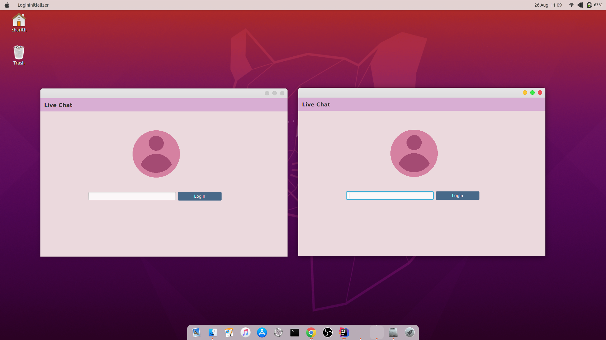
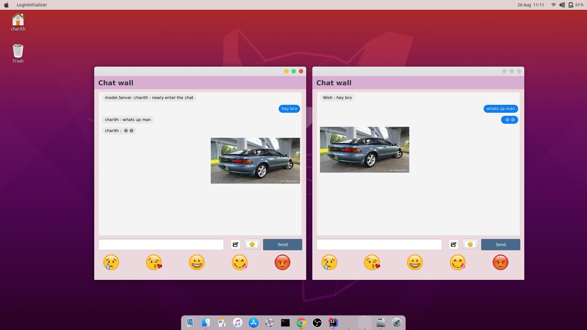

# Multi User Chat Application

## Description
#### This is a multi-user chat application that created using network socket programming
#### The system can use many users with using same ip address and server port

#### This system can be managed following activities,
* Can log in using user name
* Show the active users
* can send a message to the group chat
* can send emojis to the group chat
* can send images to the group chat
## Sample Screenshots

## Technology Stack
* Java
* JavaFx
* Multi Threading
* MVC extended Architecture

**Developed By _Wishvajith_**